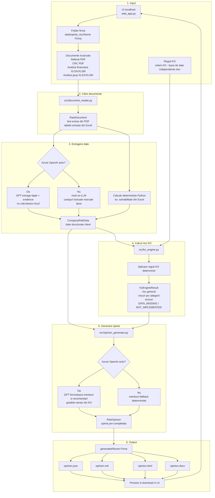

# Arhitectura Input -> Output

```mermaid
flowchart TB
    subgraph S1[1. Input]
        A1[UI localhost<br/>web_app.py]
        A2[Folder firma<br/>data/opinie_risc/Nume Firma]
        A3[Documente incarcate<br/>Referat PDF<br/>CRC PDF<br/>Analiza financiara XLSX/XLSM<br/>Analiza grup XLSX/XLSM]
        A4[Reguli KO<br/>criterii KO - baze de date independente.xlsx]
    end

    subgraph S2[2. Citire documente]
        B1[src/document_reader.py]
        B2[RawDocument<br/>text extras din PDF<br/>tabele extrase din Excel]
    end

    subgraph S3[3. Extragere date]
        C1{Azure OpenAI activ?}
        C2[Da<br/>GPT extrage fapte + evidence<br/>nu calculeaza riscul]
        C3[Nu<br/>mod no-LLM<br/>campuri textuale marcate lipsa]
        C4[Calcule deterministe Python<br/>ex: solvabilitate din Excel]
        C5[CompanyRiskData<br/>date structurate client]
    end

    subgraph S4[4. Calcul risc KO]
        D1[src/ko_engine.py]
        D2[Aplicare reguli KO determinist]
        D3[KoEngineResult<br/>risc general<br/>riscuri pe categorii<br/>scoruri<br/>DATA_MISSING / NOT_IMPLEMENTED]
    end

    subgraph S5[5. Generare opinie]
        E1[src/opinion_generator.py]
        E2{Azure OpenAI activ?}
        E3[Da<br/>GPT formuleaza mentiuni si recomandari<br/>gradele raman din KO]
        E4[Nu<br/>mentiuni fallback deterministe]
        E5[RiskOpinion<br/>opinia pre-completata]
    end

    subgraph S6[6. Output]
        F1[generated/Nume Firma]
        F2[opinion.json]
        F3[opinion.md]
        F4[opinion.html]
        F5[opinion.docx]
        F6[Preview si download in UI]
    end

    A1 --> A2
    A2 --> A3
    A3 --> B1
    B1 --> B2

    B2 --> C1
    C1 --> C2
    C1 --> C3
    B2 --> C4
    C2 --> C5
    C3 --> C5
    C4 --> C5

    C5 --> D1
    A4 --> D1
    D1 --> D2
    D2 --> D3

    C5 --> E1
    D3 --> E1
    E1 --> E2
    E2 --> E3
    E2 --> E4
    E3 --> E5
    E4 --> E5

    E5 --> F1
    F1 --> F2
    F1 --> F3
    F1 --> F4
    F1 --> F5
    F2 --> F6
    F3 --> F6
    F4 --> F6
    F5 --> F6
    F6 --> A1
```
